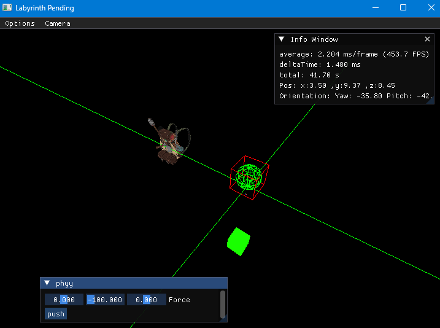

# Labyrinth_Pending
A game made from scratch about a foggy labyrinth.
Made with c++20.



### Uses:
   - [glad](https://github.com/Dav1dde/glad) to load OpenGL
   - [glfw](https://github.com/glfw/glfw) for window i/o
   - [glm](https://github.com/g-truc/glm) for a math library
   - [nothings/stb](https://github.com/nothings/stb) for loading/writing images
   - [assimp](https://github.com/assimp/assimp) for loading models
   - [nlohmann/json](https://github.com/nlohmann/json) for loading json
   - [Bullet Physics 3 SDK](https://github.com/bulletphysics/bullet3) as a physics library
     + Currently as a copy of files in their repo, due to *technial difficulties*
   - [SoLoud](https://github.com/jarikomppa/soloud) as the sound engine
   - [ImGui](https://github.com/ocornut/imgui) for debug UI
   - [lua](https://www.lua.org) as a scripting language
   - [lua git submodule-er helper](https://github.com/lubgr/lua-cmake) so lua can be loaded as a git submodule and easily added to CMake

## Building:

Labyrinth_Pending uses cmake version 3.31 to build. <br>
Currently we only support GCC with a minimum version of 13.0, thought the latest is recommended. <br>
On Windows we use [MingW-w64](https://www.mingw-w64.org/) to build with GCC <br>


1. Clone Repo:
```shell
git clone --recurse-submodules
```
2. Build Repo:
```shell
cmake -list-presets
cmake --preset="preset_name"

cmake --build -list-presets
cmake --preset="preset_name" 
```
3. Get Coffee as build process takes a while
4. Run executable as:
```
./build/[chosen preset name]/Labyrinth.exe
```

## Controls:
 - WSAD for movement
 - F1 for blocking/unblocking the input (focusing/unfocusing on it)
   + allows for interaction with ImGui